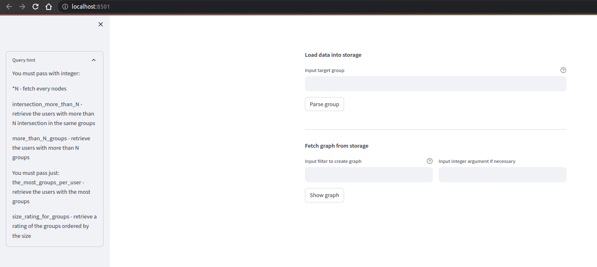
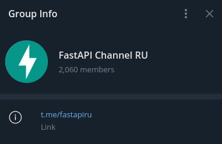
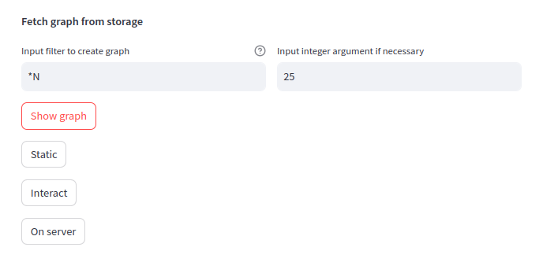
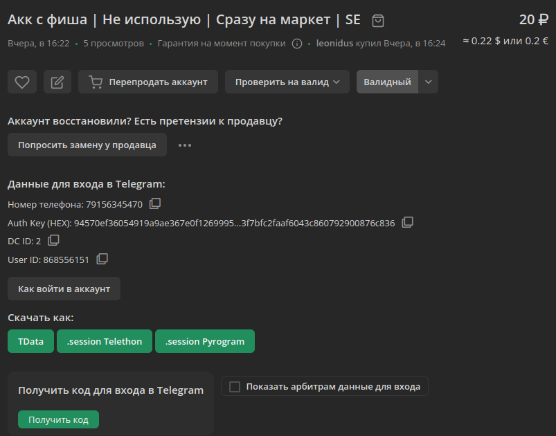
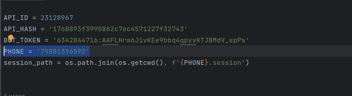
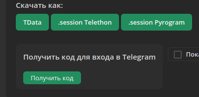

# tg_aggregator-

**UPD 28.07**

sudo APP_NAME=groupint NEO4J_USER=neo4j NEO4J_PASSWORD=difficulties-pushup-gaps docker-compose up

Запустить docker compose 

    $ docker compose up

Запустить streamlit

    $ streamlit run interface.py

Перейти на http://localhost:8501/

Для загрузки данных из группы ввести имя группы в разделе<br>**Load data into storage** : вводим _fastapiru_

<br>Для получения графа ввести запрос (**hint в sidebarе**) в разделе<br>**Fetch graph from storage**

<br>Нажать show graph и выбрать один из трех вариантов:
<ul>
<li>Статический граф</li>
<li>Интерактивный (нормально идут порядка 25-30 узлов)</li>
<li>Интерактивный на сервере (500 узлов)</li>
</ul>
Чтобы повторить запрос нажать повторно show graph и выбрать другой тип графа<br>
С тг могут быть проблемы, на акках часто сбрасывают сессию. Тогда нужно действовать по иснтрукции ниже.
<br><br><br><br>


**Инструкция по обновлению сессии**
Новую сессию можно взять, например, здесь.
https://lzt.market/

<ul>
<li>Скачиваем файл .session</li>
<li>Переименовываем в phone_number.session: например 79881396592.session</li>
<li>Добавляем новый файл в корень проекта в одной директории с main.py</li>
<li>В core/tg_api_connector указываем новый номер телефона.</li>
    

<li>При первом запуске скрипта может потребовать ввести в консоле номер телефона и затем код. Код можно получить после ввода номера на странице с товаром: кнопка получить код</li>
        

</ul>

**LEGACY**<br>
Это данные акка.<br>


Вот эти три получешь здесь при регистрации приложения https://core.telegram.org/api/obtaining_api_id

    API_ID
    API_HASH
    BOT_TOKEN


По сути он принимает зарегестрированный аккаунт в телеграмме. Это может быть фейк или личный аккаунт.
Свой номер лучше не вводить, там тогда выходит из всех приложений.
Указываешь номер, где phone. Подключаешься через метод     

    async def start(self) -> None:
            await self.client.start()
            
При инициализации он запрашивает пароль от акка.

    
    Я взял акк здесь. Там же после покупки можно скачать сразу файл .session.
    https://lzt.market/
    

Он создает сессию (файлик .session) в формате SQlite.
Здесь лежит сессия.


    async def main(channel: Union[str, int]) -> tuple[str, int, int, list]: 
    Принимает id или имя канала (группы). 
    Когда копируешь имя в телеге получешь формат URLа https://t.me/fastapiru. 
    Нужно оставить только путь, то есть fastapiru

    parser = ChannelParser(API_ID, API_HASH, PHONE, BOT_TOKEN) Создаем парсер. 
    В инициализацию передаем идентификационные данные.

    parser.client = 'telethon' Здесь можно любое имя писать, 
    но сессия будет по новой активироваться с вводом пароля от акка.
    
    await parser.start() Стартуем, если нет привязанной сессии, 
    то запросит пароль и создат файл сессии
    
    await parser.join_channel(channel) Вступает в группу. 
    Вообще поведение и возможности абсолютно идентичны 
    пользователю телеграмма (этот то же клиентское приложение, только с некой логикой внутри)
    
    channel_instance = await parser.get_all_participants(channel) Получаем результаты


Если акк уже вступил в группу, лучше закоментить строку 

      # await parser.join_channel(channel)
      
Один акк так уже заблокировали.

Здесь вводим саму группу или канал.


Здесь основная логика. Так как каналы и группы имеют разные интерфейсы, то идет определение что это.За это отвечает entity.broadcast.


Для каналов получение пользователей немного сложнее по логике. limit это размер чанка, который выдаст генератор. 

Группы:

    get_chunked_participants Я постаивл 5000, но если канал больше пользователь имеет,
    можно и больше постаивть. Ограничений я пока что не увидел.
    get_comments_from_chat Аналогично ограничений не увидел. 


Каналы:

    get_comments_from_channel
    get_messages Поставил 50, также можно что угодно выставлять, 
    это получение сообщений из чатов в канале 

Само собой, чем больше данных нужно выгрузить, тем дольше будет работать. Но в целом все очень быстро происходит. Сам фреймворк нативно ассинхронный.


логин и пароль от субд задается в окружении docker-compose
    environment:
      - NEO4J_AUTH=neo4j/difficulties-pushup-gaps

web интерфейс субд здесь авторизация с теми же данными
        
    http://localhost:7474/browser/

Запустить можно из main.py передав в метод load_data id или название группы/канала
    
    asyncio.run(DataManager.load_data('<channel>'))

Выгрузить данные передав в метод get_data один из ключей словаря query_dict db/queries.py, по дефолту выгружает 
в хеш мапу (dict), аргументом n передать целочисленное значение(если необходимо для запроса), 
можно передать аргументом out_type тип выгрузки table, dframe (нужен pandas для обработки), dict.

    asyncio.run(DataManager.get_data(<commad: str>, <n: int>, <out_type: str>))

------
TIPs on how to make the project running 

I'm running all this in the WSL2 Ubuntu 22

Prerequisites
1. [[Docker composer]] -> to run neo4j database
2. python3.11 -> required by the project
3. python3.11 virtual env -> to have a clean environment
4. poetry -> to install python deps

launch docker composer in order to launch the neo4j
```
git clone https://gitlab.com/osint-for-ukraine/telesint-bot.git
cd telesint-bot
sudo docker compose up -d
sudo docker compose ps
hostname -I # to access UI
and then in the browser host:7474
```

1.  [x] you have access to neo4j from the browser
    1. neo4j is running services simulatenously on multiple ports 
    one seems to be hosting database and another one the ui for neo4j 

```
sudo apt-get install python3.11
```

2.  [x] pyhon3.11 

```
sudo apt-get install python3.11-venv
python3.11 -m venv venv
. venv/bin/activate
```

3.  [x] venv created and activated

```
# instal poetry
curl -sSL https://install.python-poetry.org | python3 -
```

4.  [x] poetry installed
now we need to install the deps for the python wheel, which is described by [[pyproject.toml]]

```
python3.11 -m pip install . //Note there was an error in pyproject.toml, the folder is called core not aggregator
```


[x] project ready to be executed