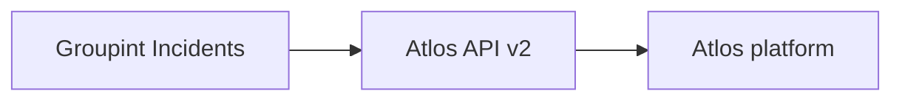

# Atlos export (API)

Push geocoded **Incident** data from Groupint to [Atlos](https://atlos.org) via API v2 (`POST /api/v2/incidents/new`).

## Prerequisites

- Incidents with **lat/lon** (pipeline + geocode completed)
- Atlos API token with permission to create incidents in your project
- `ATLOS_API_TOKEN` in `.env` and/or saved in the Incidents UI

## Workflow

1. Open **Incidents** in Groupint (http://localhost:18501).
2. Set the same **date** and **category** filters as on the map.
3. Under **Export to Atlos (API)**:
   - Choose URL preset (local Docker or cloud `https://platform.atlos.org`).
   - Enter or save **API token** → **Save Atlos settings**.
   - **Test Atlos connection** (optional).
   - Click **Export filtered incidents to Atlos**.

For a local Atlos dev stack, see [Docker: full stack with Atlos](../docker/full-stack-with-atlos.md).

## Configuration

| Source | Variables |
|--------|-----------|
| `.env` | `ATLOS_BASE_URL`, `ATLOS_API_TOKEN` |
| Incidents UI | Saved on `IncidentMonitorConfig` in Neo4j (overrides env) |
| `secrets.toml` `[atlos]` | Optional defaults |

See [Configuration](../configuration.md).

## Payload

Each incident is sent with:

- `description` — category, location, summary, date (min. 8 characters)
- `status` — default `To Do`
- `sensitive` — default `Not Sensitive`
- `tags` — incident category
- `geolocation` — `latitude,longitude` when lat/lon exist
- `urls` — Telegram source links when present

Exported incidents store `atlos_slug` in Neo4j; enable **Skip incidents already exported** to avoid duplicates.

## Code

- API client: `core/incidents/atlos_export.py`
- UI: `pages/2_Incidents.py` — **Export to Atlos (API)**
- Tests: `tests/test_atlos_export.py`

## Troubleshooting

| Problem | What to do |
|---------|------------|
| Token empty | Set `ATLOS_API_TOKEN` or save token in UI |
| HTTP 401/403 | Regenerate token on Atlos; check project permissions |
| Connection failed (local) | Run `./scripts/up-full.sh`; use `http://atlos:4000` from Streamlit container |
| Export failed for row | Open **Export errors** expander; check description length and coordinates |

See also [Troubleshooting](../troubleshooting.md).

## Related

- [Incidents overview](overview.md)
