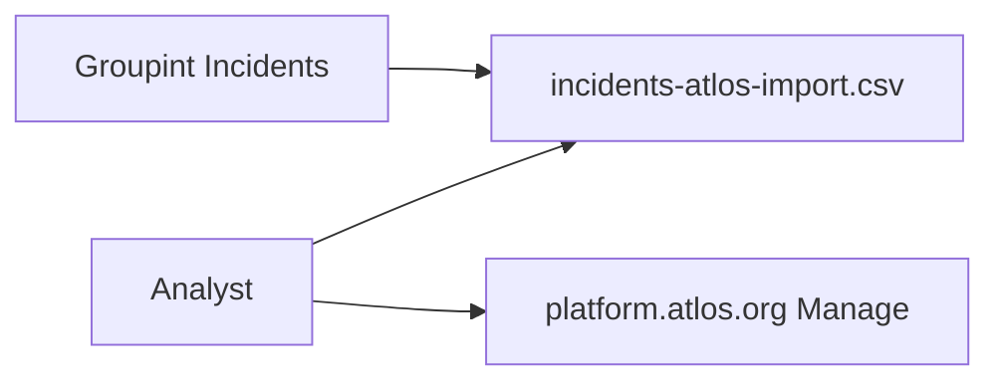

# Atlos export (manual CSV bulk import)

Export geocoded **Incident** data from Groupint as a CSV file, then import it manually into [Atlos](https://atlos.org) on the cloud (**https://platform.atlos.org**).

This is the supported workflow today. **API push from Groupint is disabled** in the UI (code remains in `core/incidents/atlos_export.py` for a future release).

## Prerequisites

- Incidents with **lat/lon** on the map (pipeline + geocode completed)
- An Atlos project where you are **owner or manager** (bulk import permission)

## Workflow



1. Open **Incidents** in Groupint (http://localhost:18501).
2. Set the same **date** and **category** filters as on the map.
3. Under **Export for Atlos (manual bulk import)**:
   - Choose default **status** and **sensitive** values if needed.
   - Click **Download CSV for Atlos bulk import**.
4. On Atlos:
   - Open your project → **Manage**.
   - Scroll to **Bulk import** → **Upload a file**.
   - Review the preview → **Publish to Atlos**.

Official Atlos guide: [Import and export data](https://docs.atlos.org/investigations/import-and-export-data/).

## CSV columns

Groupint writes these headers (lowercase — Atlos is case-sensitive):

| Column | Required | Content |
|--------|----------|---------|
| `status` | Yes | Default `To Do` (configurable in UI: To Do, Unclaimed, In Progress) |
| `description` | Yes | Category, location, summary, date (min. 8 characters) |
| `sensitive` | Yes | Default `Not Sensitive` (editable in UI) |
| `geolocation` | No | `latitude,longitude` e.g. `49.9935,36.2304` |

Optional Atlos columns (tags, urls, custom attributes) depend on your **project data model**. Check column names on the **Bulk import** section of your project **Manage** page if `geolocation` is not recognized — rename the column in Excel/Sheets to match your project’s geolocation attribute API id.

Only incidents **with coordinates** matching the current map filters are included (same set as the Folium map).

## Example row

```csv
status,description,sensitive,geolocation
To Do,"[shelling] Kharkiv oblast

Drone strike reported near...

Occurred: 2024-06-01",Not Sensitive,49.9935,36.2304
```

## Code

- CSV builder: `core/incidents/atlos_csv_export.py`
- UI: `pages/2_Incidents.py` — section **Export for Atlos (manual bulk import)**
- Tests: `tests/test_atlos_csv_export.py`

## API export (disabled)

Automatic export via Atlos API v2 (`POST /api/v2/incidents/new`) is implemented in `core/incidents/atlos_export.py` but **not exposed** in the Incidents UI. To re-enable later, set `ATLOS_API_EXPORT_ENABLED = True` in `pages/2_Incidents.py` and configure `ATLOS_API_TOKEN` / Neo4j Atlos settings.

For a local Atlos dev stack (optional, not required for cloud import), see [Docker: full stack with Atlos](../docker/full-stack-with-atlos.md).

## Troubleshooting

| Problem | What to do |
|---------|------------|
| CSV empty | Widen date range; run pipeline; ensure incidents have lat/lon |
| Bulk import fails on headers | Use exact lowercase: `status`, `description`, `sensitive` |
| Geolocation not imported | Match column name to your Atlos project attributes in Manage |
| `sensitive` parse error | Quote values that contain commas (Groupint CSV uses standard quoting) |

See also [Troubleshooting](../troubleshooting.md).

## Related

- [Incidents overview](overview.md)
- [Incident map filters](overview.md#typical-workflow)
