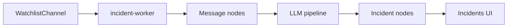

# Incidents overview

The **Incidents** page automates OSINT incident mapping: monitor Telegram channels on a watchlist, ingest messages, run an LLM pipeline, geocode locations, and display incidents on a map.

Design adapted from [Telegram-OSINT-Incident-Mapping](https://github.com/Namithnp/Telegram-OSINT-Incident-Mapping) (MIT). Groupint uses Telethon, Neo4j, and Anthropic/OpenAI.

Open the page from the Streamlit sidebar: **Incidents** (`pages/2_Incidents.py`).

## Architecture



| Component | Role |
|-----------|------|
| `groupint-incident-worker` | Background loop: scheduler, fetch, optional pipeline |
| `core/incidents/` | Pipeline stages, LLM, geocode, monitor |
| `scripts/incident-worker.py` | Worker entrypoint |
| `db/queries.py` | Incident Cypher |

## Neo4j model

| Label | Key fields |
|-------|------------|
| `IncidentMonitorConfig` | Singleton `id: default` — global keywords, scheduler, Atlos URL/token |
| `WatchlistChannel` | `channel_ref`, `enabled`, keywords, `last_polled_at` |
| `Message` | `text_clean`, `incident_pipeline_stage`, `category`, `location_text`, `lat`, `lon` |
| `Incident` | `id`, `category`, `location_text`, `lat`, `lon`, `occurred_at`, `summary`, `atlos_slug` |

Relationships:

- `(Message)-[:REPORTS]->(Incident)`
- `(Incident)-[:FROM_CHANNEL]->(Group)`

## Pipeline stages (summary)

1. **keyword_prefilter** — optional global/per-channel keyword filter
2. **clean** — normalize message text
3. **incident_filter** — LLM: is this an incident report?
4. **dedupe** — avoid duplicate incidents
5. **extract** — category, location, time
6. **geocode** — lat/lon (Google Maps or Nominatim)

Without LLM API keys, ingest still runs; LLM stages are skipped quietly.

## Typical workflow

1. **Authorize Telegram** on the Incidents page (same flow as main app).
2. **Add watchlist channels** — single add or [bulk import](watchlist-and-import.md).
3. Configure [keywords and scheduler](keywords-and-scheduler.md).
4. **Fetch watchlist now** or enable automatic scheduler.
5. **Run pipeline now** (or let worker run pipeline after fetch).
6. View the **Incident map**; export GeoJSON, JSON, CSV; optional [Atlos CSV bulk import](atlos-export.md).
7. **Generate intelligence report** for a text summary.

## Configuration

Environment and secrets: see [Configuration](../configuration.md).

Worker logs:

```bash
docker logs -f groupint-incident-worker
```

## Related guides

- [Watchlist and bulk import](watchlist-and-import.md)
- [Keywords and scheduler](keywords-and-scheduler.md)
- [Atlos export](atlos-export.md)
- [Docker desktop stack](../docker/desktop-stack.md)
