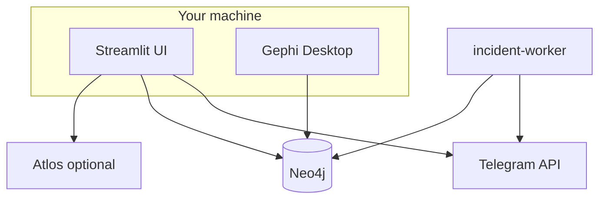

# Groupint documentation

**Groupint** is an OSINT application by [OSINT for Ukraine](https://www.osintforukraine.com/) for investigating Telegram communities. It scrapes group data via your Telegram account (Telethon), stores relationships in **Neo4j**, and visualizes networks in Streamlit and Gephi.

This documentation covers installation, Docker deployment, Telegram authentication, the main scraping UI, the **Incidents** pipeline (watchlist monitoring, LLM extraction, maps, Atlos export), and troubleshooting.

## Quick links


| Task                           | Guide                                                                  |
| ------------------------------ | ---------------------------------------------------------------------- |
| First-time setup               | [Installation](installation.md)                                        |
| Run with Docker                | [Desktop stack](docker/desktop-stack.md)                               |
| Connect Telegram               | [Sessions and auth](telegram/sessions-and-auth.md)                     |
| Scrape a group                 | [Main application](main-application.md)                                |
| Monitor channels for incidents | [Incidents overview](incidents/overview.md)                            |
| Export to Atlos (API)          | [Atlos export](incidents/atlos-export.md)                              |
| Import graph into Gephi        | [Neo4j and Gephi](neo4j-and-gephi.md)                                  |
| Full workflow (Ukrainian)      | [Tutorial: Grizzly SMS → Gephi + Claude](tutorial-full-workflow-uk.md) |


## Table of contents

### Getting started

- [Overview](overview.md) — what Groupint does and how the pieces fit together
- [Installation](installation.md) — prerequisites, clone, environment files
- [Configuration](configuration.md) — environment variables and secrets

### Deployment

- [Docker: desktop stack](docker/desktop-stack.md) — Neo4j + Streamlit + incident worker (`up-desktop.sh`)
- [Docker: full stack with Atlos](docker/full-stack-with-atlos.md) — optional local Atlos for incident export

### Telegram

- [Credentials and API keys](telegram/credentials-and-api.md) — api_id, api_hash from my.telegram.org
- [Sessions and authentication](telegram/sessions-and-auth.md) — OTP, StringSession, multi-tab behavior

### Using Groupint

- [Main application](main-application.md) — scrape members, messages, endorsements; in-app graphs
- [Neo4j and Gephi](neo4j-and-gephi.md) — Bolt ports, Gephi Neo4j plugin import

### Incidents (OSINT mapping)

- [Incidents overview](incidents/overview.md) — pipeline, Neo4j model, worker
- [Watchlist and bulk import](incidents/watchlist-and-import.md) — channels, paste/upload lists
- [Keywords and scheduler](incidents/keywords-and-scheduler.md) — filters and automatic fetch
- [Atlos export](incidents/atlos-export.md) — push incidents via Atlos API v2

### Advanced

- [Development](development.md) — Poetry, tests, pre-commit, contributing
- [Troubleshooting](troubleshooting.md) — common errors and fixes
- [Tutorial (UK): full OSINT chain](tutorial-full-workflow-uk.md) — Grizzly SMS → Telegram → Groupint → Gephi → gephi-ai

## Architecture (high level)




## Single-file manual and PDF

Generate a consolidated manual and printable PDF from the modular guides:

```bash
./scripts/build-docs.sh
```


| Output                | Path                                              |
| --------------------- | ------------------------------------------------- |
| Consolidated Markdown | `docs/groupint-manual.md` (generated, gitignored) |
| PDF                   | `dist/groupint-manual.pdf` (generated)            |


Requires [pandoc](https://pandoc.org/) and a LaTeX engine (`xelatex`, `pdflatex`, or `tectonic`). See [Development — Building documentation](development.md#building-documentation).

Markdown-only (no PDF): `BUILD_DOCS_PDF=0 ./scripts/build-docs.sh`

## Repository

- Source: [github.com/OSINT-for-Ukraine/groupint](https://github.com/OSINT-for-Ukraine/groupint)
- License: [AGPL-3.0](https://www.gnu.org/licenses/agpl-3.0.en.html)

