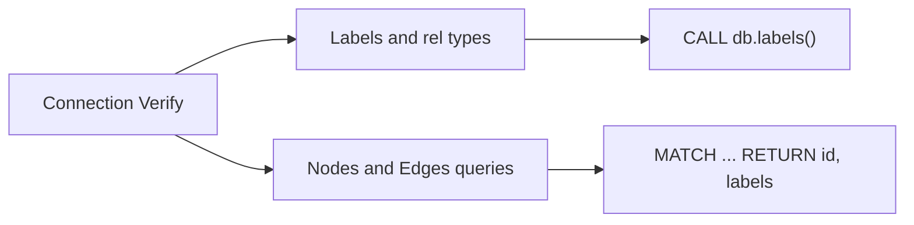

# Neo4j and Gephi

Import the Groupint graph from Neo4j into [Gephi](https://gephi.org/) using the official **Neo4j plugin** (Gephi 0.10+ → neo4j-plugin 4.x).

The database contains labels `User`, `Group`, `Message` and relationships `MEMBER_OF`, `IN_GROUP`, `ENDORSES`.

## Connection (required first step)

Gephi runs on your **host**; Neo4j runs in Docker. Use the **published Bolt port**.

| Field | Desktop stack (`up-desktop.sh`) | Legacy (`docker-compose.yml`) |
|-------|--------------------------------|-------------------------------|
| URL | `neo4j://localhost:17687` or `bolt://localhost:17687` | `neo4j://localhost:7687` |
| Authentication | **No authentication** | Same |
| Database | empty or `neo4j` | same |
| Username/password | leave empty | do not use password with `NEO4J_AUTH=none` |

Click **Verify** before **Next**. If Verify fails, label lists on step 2 stay empty.

**Common mistake:** default URL `neo4j://localhost` (port 7687) while only the desktop stack is running (Bolt on **17687**).

Neo4j Browser (HTTP): http://localhost:17474 — not used by the Gephi Bolt importer.

## Wizard tabs (do not confuse)



| Tab | Fills label picker? | Mechanism |
|-----|---------------------|-----------|
| **Labels & Relationship types** | Yes | `CALL db.labels()` / `CALL db.relationshipTypes()` |
| **Nodes & Edges queries** | No | Custom Cypher for import only |

The test query `MATCH (n) RETURN id(n) AS id, labels(n) AS labels` does **not** populate the first tab’s label list.

## Import mode A — Labels (recommended)

After successful Verify:

1. Tab **Labels & Relationship types**
2. Node labels: `User`, `Group` (optional `Message` for small graphs)
3. Relationship types: `MEMBER_OF`, `IN_GROUP`, `ENDORSES`
4. Finish import

## Import mode B — Custom Cypher

Tab **Nodes & Edges queries**. Example membership graph without all messages:

**Nodes:**

```cypher
MATCH (u:User) RETURN id(u) AS id, labels(u) AS labels
```

**Edges:**

```cypher
MATCH (u:User)-[r:MEMBER_OF]->(g:Group)
RETURN id(r) AS id, type(r) AS type, id(u) AS sourceId, id(g) AS targetId
```

On Neo4j 5+, if `id()` causes issues, try `elementId(n) AS id`.

For large graphs, add `LIMIT` or filter by `g.id`.

## Verify from shell

```bash
docker exec groupint-neo4j cypher-shell -a bolt://localhost:7687 \
  "CALL db.labels() YIELD label RETURN label ORDER BY label"

docker exec groupint-neo4j cypher-shell -a bolt://localhost:7687 \
  "MATCH (n) RETURN id(n) AS id, labels(n) AS labels LIMIT 5"
```

Expected labels: `Group`, `Message`, `User`.

## In-app graphs (alternative)

Groupint builds Plotly graphs in Streamlit (**Graph by common groups**, **Graph by endorsements**). Use Gephi for advanced layout, filtering, and publication export.

## gephi-ai + Claude

After importing into Gephi, you can analyze the graph with [gephi-ai](https://github.com/MattArtzAnthro/gephi-ai) and Claude. Full steps: [Tutorial (UK)](tutorial-full-workflow-uk.md) (Section 5).

## References

- Plugin: https://gephi.org/desktop/plugins/neo4j-plugin/
- Repo: `db/neo4j_browser.py`, `streamlit_utils/text.py`
