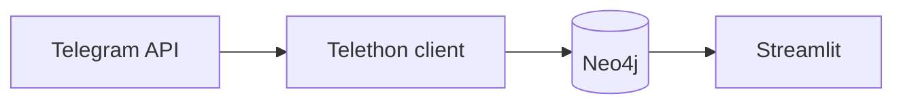

# Overview

Groupint helps investigators map **who talks to whom** in Telegram groups and channels. It is built for OSINT workflows: collect structured data, store it in a graph database, explore relationships visually, and (optionally) run an automated **incident mapping** pipeline on watchlisted channels.

## Two main surfaces

| Surface | Entry point | Purpose |
|---------|-------------|---------|
| **Main app** | `interface.py` (default Streamlit page) | Target one Telegram group: scrape members, messages, endorsements; build Plotly graphs |
| **Incidents** | `pages/2_Incidents.py` | Watchlist of channels; scheduled fetch; LLM pipeline; Folium map; export to Atlos |

Both share the same Neo4j database and Telegram session infrastructure.

## Data flow

1. You authorize **your** Telegram account (not a bot token for scraping groups you can access as a user).
2. Groupint resolves a group reference (`@name`, `t.me/...`, title) to a canonical Neo4j `Group` id.
3. Scraped `User`, `Message`, and relationship data persist in Neo4j.
4. You explore via in-app graphs or export to **Gephi** via the Neo4j plugin.

## Incident pipeline (optional)

For **channels** (not only groups), the Incidents module:

1. Polls watchlisted channels on a schedule (or manually).
2. Prefilters messages by keywords (global and/or per-channel).
3. Runs LLM stages: clean text, detect incidents, deduplicate, extract category/location, geocode.
4. Creates `Incident` nodes linked to messages and channels.
5. Displays a map in Streamlit; exports GeoJSON/JSON/CSV or pushes to **Atlos**.

See [Incidents overview](incidents/overview.md).

## Technology stack

| Component | Role |
|-----------|------|
| [Telethon](https://docs.telethon.dev/) | Telegram user API client |
| [Streamlit](https://streamlit.io/) | Web UI |
| [Neo4j](https://neo4j.com/) | Graph storage |
| [Anthropic](https://www.anthropic.com/) / [OpenAI](https://openai.com/) | Incident LLM (configurable) |
| [Atlos](https://atlos.org/) | Optional incident platform (API v2 export) |

## What Groupint is not

- Not a mass-registration or spam tool — use in line with Telegram ToS and applicable law.
- Not a replacement for Telegram’s official moderation tools.
- Not a hosted SaaS — you run it locally or in your own Docker environment.

## Next steps

- [Installation](installation.md)
- [Main application](main-application.md)
- [Docker desktop stack](docker/desktop-stack.md)
