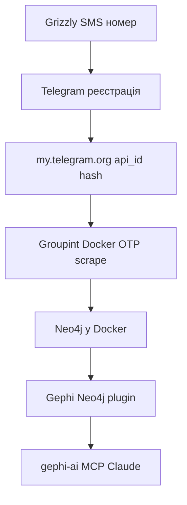

# Повний туторіал: від номера Grizzly SMS до Gephi + Claude

Оновлено: 2026-05-19

Цей посібник описує повний ланцюг OSINT-роботи з **Groupint**: отримати віртуальний номер, зареєструвати Telegram і API-ключі, зібрати дані групи в Neo4j, візуалізувати граф у Gephi та аналізувати його за допомогою **gephi-ai** і Claude.

Пов’язані нотатки: [Sessions and auth](telegram/sessions-and-auth.md), [Main application](main-application.md), [Neo4j and Gephi](neo4j-and-gephi.md).

---> Public documentation hub: [Documentation index](index.md)

---

## Зміст

1. [Швидкий чеклист](#швидкий-чеклист)
2. [Порти та URL](#порти-та-url)
3. [Розділ 1 — Grizzly SMS](#розділ-1--grizzly-sms-віртуальний-номер-для-telegram)
4. [Розділ 2 — Telegram і API credentials](#розділ-2--реєстрація-telegram-та-app_id--app_hash)
5. [Розділ 3 — Groupint](#розділ-3--groupint-встановлення-та-підключення)
6. [Розділ 4 — Neo4j → Gephi](#розділ-4--neo4j--gephi-офіційний-neo4j-plugin)
7. [Розділ 5 — gephi-ai + Claude](#розділ-5--gephi-ai--claude)
8. [Глосарій](#глосарій)
9. [Посилання](#посилання)




---

## Швидкий чеклист

1. Зареєструватися на Grizzly SMS, поповнити баланс, купити номер для **Telegram**.
2. Зареєструвати акаунт у додатку Telegram з цим номером (код з панелі Grizzly).
3. На [my.telegram.org](https://my.telegram.org/apps) отримати **api_id** і **api_hash** для цього номера.
4. Клонувати Groupint, створити `.streamlit/secrets.toml`, запустити `./scripts/up-desktop.sh`.
5. У Streamlit ([http://localhost:18501](http://localhost:18501)) підключити Telegram: Create client → OTP → Verify → збережена сесія.
6. Зібрати дані цільової групи: учасники, повідомлення, (за потреби) endorsements → Neo4j.
7. У Gephi: Neo4j plugin → `neo4j://localhost:17687`, No auth, Verify → імпорт `User` / `Group` / `MEMBER_OF`.
8. Зберегти проєкт Gephi (`.gephi`).
9. Встановити [gephi-ai](https://github.com/MattArtzAnthro/gephi-ai): Java plugin + MCP server + Claude.
10. Запустити Gephi, перевірити `http://127.0.0.1:8080/health`, у Claude — аналіз графа (modularity, layout, export).

---

## Порти та URL


| Сервіс                                | Desktop stack (`scripts/up-desktop.sh`)          | Legacy (`docker-compose.yml`)                  |
| ------------------------------------- | ------------------------------------------------ | ---------------------------------------------- |
| Groupint (Streamlit)                  | [http://localhost:18501](http://localhost:18501) | [http://localhost:8501](http://localhost:8501) |
| Neo4j Browser (HTTP)                  | [http://localhost:17474](http://localhost:17474) | [http://localhost:7474](http://localhost:7474) |
| Neo4j Bolt (Gephi, драйвери на хості) | `bolt://localhost:17687`                         | `bolt://localhost:7687`                        |
| gephi-ai HTTP API (у Gephi Desktop)   | [http://127.0.0.1:8080](http://127.0.0.1:8080)   | той самий                                      |


Neo4j у контейнері Streamlit: `bolt://groupint-neo4j:7687` (внутрішня мережа Docker; для Gephi на хості використовуйте **опублікований** порт).

---

## Розділ 1 — Grizzly SMS (віртуальний номер для Telegram)

### Мета

Отримати тимчасовий номер телефону, на який Telegram надішле SMS-код під час реєстрації або повторного входу.

### Передумови

- Браузер і спосіб оплати на [Grizzly SMS](https://www.grizzlysms.com/telegram).
- Розуміння, що номер **одноразовий для верифікації** — не замінює власну SIM для довгострокової 2FA.

### Покроково

1. **Реєстрація** на сайті Grizzly SMS (email / OAuth — залежно від поточного інтерфейсу).
2. **Поповнення балансу** (банківська картка, криптовалюта тощо — див. доступні методи на сайті).
3. У каталозі сервісів оберіть **Telegram**, не WhatsApp чи інші месенджери.
  - Сторінка сервісу: [https://www.grizzlysms.com/telegram](https://www.grizzlysms.com/telegram)
4. **Країна номера:** ціна й наявність залежать від країни. Для OSINT логічно обрати країну, пов’язану з цільовою спільнотою (не обов’язково Україна). Перевірте, що є достатня кількість номерів у наявності.
5. Натисніть **купити / отримати номер**. Скопіюйте номер у **міжнародному форматі** з `+` на початку, наприклад `+37360123456`.
6. **Не закривайте** сторінку з активним номером, поки не завершите:
  - реєстрацію в Telegram (Розділ 2);
  - за потреби — OTP у Groupint (Розділ 3).
7. У додатку Telegram введіть цей номер. Коли з’явиться поле для коду — поверніться на Grizzly: у розділі **SMS / Activations** з’явиться текст повідомлення з кодом (зазвичай 5–6 цифр).
8. Введіть код у Telegram до закінчення таймера активації на Grizzly.

### Перевірка

- Telegram показує успішний вхід / завершення реєстрації.
- У Grizzly активація позначена як використана (код отримано).

### Типові помилки


| Проблема                      | Що робити                                                                                            |
| ----------------------------- | ---------------------------------------------------------------------------------------------------- |
| Код не приходить              | Перевірити, що обрали саме **Telegram**; спробувати іншу країну; не чекати довше за ліміт активації. |
| «Номер уже использован» / ban | Взяти новий номер; не повторно використовувати старий для Telegram.                                  |
| Втратили номер до OTP         | Купити новий; у Telegram можна змінити номер лише за правилами застосунку.                           |
| Номер без `+`                 | Завжди зберігати в форматі E.164: `+код_країни...` — так очікує Groupint.                            |


### Етика та ризики

- Дотримуйтесь [Terms of Service](https://telegram.org/tos) Telegram і правил Grizzly SMS.
- Віртуальні номери не призначені для обходу блокувань або масової реєстрації ботів.
- Зберігайте облікові дані окремо; не публікуйте api_hash і сесії.

---

## Розділ 2 — Реєстрація Telegram та `app_id` / `app_hash`

### Мета

Мати робочий акаунт Telegram і **API credentials** для Telethon (їх використовує Groupint).

### Передумови

- Номер з Розділу 1 (або власний номер, якщо політика дозволяє).
- Офіційний клієнт Telegram: [Android](https://telegram.org/android), [iOS](https://telegram.org/dl/ios), [Desktop](https://desktop.telegram.org/).

### Покроково — додаток Telegram

1. Встановіть Telegram і запустіть **Sign up** / **Увійти**.
2. Введіть номер з Grizzly (`+...`).
3. Отримайте SMS-код на панелі Grizzly і введіть у Telegram.
4. Вкажіть **ім’я** (відображуване); username опційний, але зручний для OSINT-посилань `t.me/username`.
5. **Хмарний пароль (2FA):** якщо увімкнете — запишіть пароль окремо. Groupint використовує **OTP по SMS/коду з Telegram**, а не хмарний пароль при першому `StringSession`, але 2FA може знадобитися в інших клієнтах.

### Покроково — API development tools

1. Відкрийте [https://my.telegram.org](https://my.telegram.org) у браузері.
2. Увійдіть **тим самим номером** (код прийде в Telegram або на Grizzly, якщо знову запитають SMS).
3. Перейдіть у **API development tools** ([https://my.telegram.org/apps](https://my.telegram.org/apps)).
4. Заповніть форму створення застосунку:
  - **App title** — довільна назва, напр. `Groupint OSINT`.
  - **Short name** — латиниця, без пробілів, напр. `groupint`.
  - **Platform** — напр. Desktop.
  - **Description** — за бажанням.
5. Після збереження з’являться:
  - **App api_id** — число (напр. `12345678`);
  - **App api_hash** — рядок із 32 hex-символів.
6. Скопіюйте обидва значення в менеджер паролів.

**Важливо (офіційна політика Telegram):** на один номер телефону зазвичай прив’язується **один** набір api_id/api_hash. Якщо зміните номер — може знадобитися новий застосунок.

### Перевірка

- Вхід на my.telegram.org без помилок.
- api_id і api_hash відображаються на сторінці apps.

### Типові помилки


| Проблема                    | Що робити                                                                                             |
| --------------------------- | ----------------------------------------------------------------------------------------------------- |
| `ERROR` на my.telegram.org  | Зачекати кілька годин; переконатися, що акаунт не заблокований; спробувати Desktop Telegram спочатку. |
| Плутанина api_id / api_hash | api_id — **лише цифри**; api_hash — **рядок**; не міняйте місцями в Groupint.                         |
| Коміт секретів у git        | Файли `.streamlit/secrets.toml`, `.env` — **ніколи** в репозиторій.                                   |


---

## Розділ 3 — Groupint: встановлення та підключення

### Мета

Запустити Groupint у Docker, авторизувати Telethon-сесію та зібрати дані Telegram-групи в Neo4j.

### Передумови

- **Docker** (рекомендовано Docker Desktop для `scripts/up-desktop.sh`).
- **Git**, клон репозиторію.
- api_id, api_hash, номер телефону з Розділів 1–2.

Докладніше про сесії: [Sessions and auth](telegram/sessions-and-auth.md). Про scrape: [Main application](main-application.md).

### Покроково — встановлення

1. Клонуйте репозиторій:

```bash
git clone https://github.com/OSINT-for-Ukraine/groupint.git
cd groupint
```

1. Створіть файл `**.streamlit/secrets.toml**` у корені проєкту (не комітьте в git):

```toml
[telegram]
phone = "+XXXXXXXXXXX"
api_id = "12345678"
api_hash = "your_api_hash_here"
```

Замініть значення на свої. Формат телефону: міжнародний з `+`.

1. Запустіть стек Docker Desktop:

```bash
chmod +x scripts/up-desktop.sh
./scripts/up-desktop.sh
```

Очікуваний вивід: контейнери `groupint-neo4j` і `groupint-streamlit`.

1. Відкрийте в браузері: **[http://localhost:18501](http://localhost:18501)**
2. (Опційно) Neo4j Browser для ручних запитів: **[http://localhost:17474](http://localhost:17474)** (без пароля, `NEO4J_AUTH=none`).

### Покроково — підключення Telegram у UI

1. На головній сторінці знайдіть блок **Confirm your details to connect to Telegram scraper**.
2. Поля **Phone number**, **Api id**, **Api hash** мають підставитися з `secrets.toml`.
3. У бічній панелі розгорніть **Telegram sessions** — після першого успішного входу тут з’являться збережені сесії.
4. Натисніть **Create / connect Telegram client**.
  - Якщо сесія вже збережена (`*.string` у volume) — підключення без OTP.
  - Інакше Telegram надішле **код** (у додаток Telegram на той самий номер; для Grizzly — перевірте, чи номер ще активний на Grizzly).
5. Коли з’явиться **Enter your secret code**, введіть OTP і натисніть **Verify secret code**.
6. Після успіху — повідомлення про підключення; сесія зберігається в `GROUPINT_SESSIONS_DIR` (у Docker: `/home/appuser/.groupint/sessions/`).

**Перезавантаження сторінки:** за наявності `.string` файлу Groupint виконує auto-reconnect без повторного OTP (див. [Sessions and auth](telegram/sessions-and-auth.md)).

### Покроково — збір даних групи

1. У полі **Target group** вкажіть:
  - `@username_public_group`,
  - або `https://t.me/groupname`,
  - або назву (менш надійно; після resolve UI покаже **canonical Neo4j id**).
2. **Get users list** — учасники з Telegram API → вузли `User`, ребра `MEMBER_OF`, вузол `Group`.
3. **Messages** (два кроки):
  - **Get messages from group** — завантаження повідомлень у Neo4j;
  - **Extract users from stored messages** — автори з уже збережених повідомлень;
  - **Extract endorsements** — посилання між групами (`ENDORSES`).
4. Секція **Previously scraped groups** — історія з Neo4j.
5. **Manage Neo4j data** — видалення даних однієї групи або **Merge duplicate groups** (дублікати з різних id для одного чату).

Після scrape перевірте canonical id у підписі UI (напр. `Republic_of_Gagazia_Chat` або `peer:123456789`).

### Перевірка

```bash
docker ps --filter name=groupint
docker exec groupint-neo4j cypher-shell -a bolt://localhost:7687 \
  "MATCH (g:Group) RETURN g.id, g.title, g.user_counts LIMIT 10"
```

У Streamlit — успішні повідомлення після scrape, без `ValueError` unpack (див. [Troubleshooting](troubleshooting.md)).

### Типові помилки


| Проблема                        | Що робити                                                                      |
| ------------------------------- | ------------------------------------------------------------------------------ |
| Порт 18501 недоступний          | `docker logs groupint-streamlit`; перезапуск `./scripts/up-desktop.sh`.        |
| `secrets.toml` не підхоплюється | Файл у **корені** repo; volume `.:/app` — перезапустити контейнер.             |
| `SessionInUseError`             | Один Telethon-клієнт на номер; закрийте іншу вкладку / Disconnect.             |
| 0 повідомлень для endorsements  | Інший canonical id у Neo4j — див. [Main application](main-application.md); спочатку fetch messages. |
| Зміни коду не видно             | `docker restart groupint-streamlit`                                            |


---

## Розділ 4 — Neo4j → Gephi (офіційний Neo4j plugin)

### Мета

Імпортувати граф з Neo4j (де лежать дані Groupint) у **Gephi Desktop** для інтерактивної візуалізації та експорту.

Детальна довідка англійською: [Neo4j and Gephi](neo4j-and-gephi.md).

### Передумови

- [Gephi Desktop](https://gephi.org/users/download/) **0.10.1+** на комп’ютері (не в Docker).
- Плагін **Neo4j** для Gephi: [https://gephi.org/desktop/plugins/neo4j-plugin/](https://gephi.org/desktop/plugins/neo4j-plugin/)
- Запущений `groupint-neo4j` (Desktop stack).

### Покроково — підключення

1. У Gephi: **File → Import → Neo4j** (або еквівалент у меню плагіна Neo4j).
2. **Connection:**
  - URL: `neo4j://localhost:17687` або `bolt://localhost:17687`
  - Authentication: **No authentication**
  - Database: порожньо або `neo4j`
  - Username/Password: **порожньо**
3. Натисніть **Verify**. Лише після успіху — **Next**.
4. **Не плутайте вкладки майстра:**


| Вкладка                         | Призначення                                     |
| ------------------------------- | ----------------------------------------------- |
| **Labels & Relationship types** | Списки міток і типів ребер (`CALL db.labels()`) |
| **Nodes & Edges queries**       | Кастомний Cypher для імпорту / тесту            |


Тестовий запит `MATCH (n) RETURN id(n), labels(n)` **не** заповнює список міток на першій вкладці.

### Покроково — імпорт (рекомендований режим A)

1. Вкладка **Labels & Relationship types**.
2. Node labels: `**User`**, `**Group**` ( `**Message**` — лише для малих графів).
3. Relationship types: `**MEMBER_OF**`, `**IN_GROUP**`, `**ENDORSES**`.
4. Завершити імпорт. Дочекайтеся побудови графа в Gephi.
5. **File → Save** — зберегти `.gephi`.

### Альтернатива — режим B (Custom Cypher)

На вкладці **Nodes & Edges queries** — граф «учасник ↔ група» без усіх повідомлень:

**Nodes:**

```cypher
MATCH (u:User) RETURN id(u) AS id, labels(u) AS labels
```

**Edges:**

```cypher
MATCH (u:User)-[r:MEMBER_OF]->(g:Group)
RETURN id(r) AS id, type(r) AS type, id(u) AS sourceId, id(g) AS targetId
```

На Neo4j 5+, якщо `id()` ламає імпорт, спробуйте `elementId(n) AS id`.

Для великих баз додайте `LIMIT` або фільтр по `g.id`.

### Перевірка

- У Gephi видно вузли та ребра; Statistics → Average degree > 0.
- У терміналі (всередині контейнера порт 7687):

```bash
docker exec groupint-neo4j cypher-shell -a bolt://localhost:7687 \
  "CALL db.labels() YIELD label RETURN label ORDER BY label"
```

Очікувані мітки: `Group`, `Message`, `User`.

### Типові помилки


| Проблема              | Що робити                                                                |
| --------------------- | ------------------------------------------------------------------------ |
| Verify failed         | Перевірити **17687**, не 7687; контейнер `groupint-neo4j` running.       |
| Порожні списки labels | Спочатку Verify; не покладатися на вкладку Nodes & Edges для discovery.  |
| Gephi «зависає»       | Занадто великий граф — імпортуйте без `Message`, додайте LIMIT у Cypher. |
| Auth failed           | У desktop stack `NEO4J_AUTH=none` — не вводити neo4j/password.           |


---

## Розділ 5 — gephi-ai + Claude

### Мета

Керувати **вже імпортованим** графом у Gephi через AI-асистента (Claude): статистика, спільноти, layout, експорт PNG/PDF.

**gephi-ai не підключається до Neo4j напряму.** Ланцюг:

```
Groupint → Neo4j → Gephi (Neo4j plugin) → gephi-ai → Claude
```

Репозиторій: [https://github.com/MattArtzAnthro/gephi-ai](https://github.com/MattArtzAnthro/gephi-ai)

### Передумови


| Компонент     | Вимога                                                                                 |
| ------------- | -------------------------------------------------------------------------------------- |
| Gephi Desktop | 0.10.1+                                                                                |
| JDK           | 11+ ([Adoptium](https://adoptium.net/))                                                |
| Maven         | збірка Java-плагіна                                                                    |
| Python        | 3.10+ для MCP server                                                                   |
| Claude        | [Claude Code](https://claude.ai/code) або [Claude Desktop](https://claude.ai/download) |
| API ключ      | **Anthropic** (окремо від Telegram)                                                    |


### Архітектура

```
Claude (Code / Desktop)
        │
   MCP Protocol (stdio)
        │
   gephi-mcp (Python)          ← MCP server
        │
   HTTP http://127.0.0.1:8080
        │
   gephi-mcp-plugin (Java)     ← всередині Gephi Desktop
        │
   Gephi Desktop               ← має бути запущений і з графом
```

### Крок 1 — Gephi plugin (HTTP API)

```bash
git clone https://github.com/MattArtzAnthro/gephi-ai.git
cd gephi-ai/gephi-mcp-plugin
mvn clean package
```

У Gephi:

1. **Tools → Plugins → Downloaded → Add Plugins**
2. Оберіть `target/nbm/gephi-mcp-1.0.0.nbm`
3. **Restart** Gephi

Перевірка в браузері: [http://127.0.0.1:8080/health](http://127.0.0.1:8080/health) → `{"success": true}` (або подібна відповідь).

### Крок 2 — MCP server

```bash
cd gephi-ai/mcp-server
pip install -e .
gephi-mcp --help
```

Команда `gephi-mcp` має бути в `PATH`.

### Крок 3 — підключення Claude

#### Варіант A — Claude Code (повний плагін, рекомендовано)

```bash
claude plugin install gephi-ai/gephi-network-analysis
```

Або після клону репозиторію — встановлення з локального шляху (див. README gephi-ai).

Додає: MCP tools, slash-команди, агента network analyst, skills, health-check hook.

#### Варіант B — лише MCP tools

```bash
claude mcp add gephi-mcp -- gephi-mcp
```

#### Варіант C — Claude Desktop

У `claude_desktop_config.json`:

```json
{
  "mcpServers": {
    "gephi-mcp": {
      "command": "gephi-mcp"
    }
  }
}
```

Шлях до файлу залежить від ОС (див. документацію Anthropic). Потрібен API key Anthropic у налаштуваннях Desktop.

### Покроково — робота після імпорту з Neo4j

1. **Запустіть Gephi Desktop** і відкрийте проєкт з імпортованим графом (Розділ 4).
2. Переконайтеся, що plugin слухає порт 8080 (`/health`).
3. У Claude Code / Desktop напишіть, наприклад:
  > Перевір, чи Gephi працює
   Очікується виклик `gephi_health_check` і підтвердження з’єднання.
4. **Slash-команди** (Claude Code; namespace може бути з префіксом плагіна):
  - `/analyze-network`
  - `/community-detection`
  - `/centrality`
  - `/visualize`
  - `/import-and-explore path/to/graph.gexf`
5. **Приклад аналітичного workflow** (текстом для Claude):
  1. Обчислити degree і modularity.
  2. Розфарбувати вузли за `modularity_class`.
  3. Розмір вузлів за degree.
  4. Запустити **ForceAtlas 2** (~1000 ітерацій).
  5. Експортувати PNG для звіту.
6. **Експорт з Gephi:** File → Export → GEXF/GraphML — потім можна знову імпортувати через `/import-and-explore` у Claude Code.

### Що дає плагін (73 MCP tools)


| Категорія  | Приклади                                             |
| ---------- | ---------------------------------------------------- |
| Проєкт     | `gephi_create_project`, `gephi_save_project`         |
| Граф       | `gephi_add_nodes`, `gephi_query_nodes`               |
| Статистика | `gephi_compute_modularity`, `gephi_compute_pagerank` |
| Layout     | `gephi_run_layout`                                   |
| Вигляд     | `gephi_color_by_partition`, `gephi_size_by_ranking`  |
| Експорт    | `gephi_export_png`, `gephi_export_pdf`               |


Довідники в репозиторії: `claude-plugin/skills/gephi/SKILL.md`, `references/tool-reference.md`.

### Перевірка

- `http://127.0.0.1:8080/health` — OK.
- Claude відповідає, що Gephi доступний.
- Після команди layout вузли зміщуються в Gephi UI.

### Типові помилки


| Проблема                       | Що робити                                                                      |
| ------------------------------ | ------------------------------------------------------------------------------ |
| Health check failed            | Gephi не запущений або plugin не встановлений / не перезапущений.              |
| `gephi-mcp: command not found` | Повторити `pip install -e .` у `mcp-server`; перевірити venv і PATH.           |
| Claude «не бачить» граф        | Спочатку імпорт у Gephi (Neo4j plugin), не очікувати прямого Neo4j у gephi-ai. |
| Порожній аналіз                | У Gephi немає відкритого workspace — відкрийте `.gephi` або імпортуйте файл.   |
| Desktop MCP не працює          | Перевірити JSON config і шлях до `gephi-mcp`; перезапустити Claude Desktop.    |


### Атрибуція

При публікації результатів з gephi-ai (рекомендація авторів):

> Built with gephi-ai (Matt Artz, 2025–2026) — [https://github.com/MattArtzAnthro/gephi-ai](https://github.com/MattArtzAnthro/gephi-ai)

Ліцензія: Apache 2.0.

---

## Глосарій


| Термін                 | Пояснення                                                         |
| ---------------------- | ----------------------------------------------------------------- |
| **OTP**                | Одноразовий код від Telegram для входу / Groupint.                |
| **api_id / api_hash**  | Ключі застосунку з my.telegram.org для Telethon.                  |
| **StringSession**      | Збережений токен Telethon у файлі `.string` (без повторного OTP). |
| **canonical Group.id** | Стабільний id групи в Neo4j (`username` або `peer:{id}`).         |
| **Bolt**               | Протокол Neo4j для Gephi та драйверів (`bolt://host:port`).       |
| **MCP**                | Model Context Protocol — міст між Claude і `gephi-mcp`.           |
| **MEMBER_OF**          | Зв’язок User → Group (учасник групи).                             |
| **ENDORSES**           | Зв’язок Group → Group (посилання з повідомлень).                  |


---

## Посилання


| Ресурс                       | URL                                                                                                |
| ---------------------------- | -------------------------------------------------------------------------------------------------- |
| Groupint (OSINT for Ukraine) | [https://github.com/OSINT-for-Ukraine/groupint](https://github.com/OSINT-for-Ukraine/groupint)     |
| Grizzly SMS — Telegram       | [https://www.grizzlysms.com/telegram](https://www.grizzlysms.com/telegram)                         |
| Telegram API (api_id)        | [https://my.telegram.org/apps](https://my.telegram.org/apps)                                       |
| Telethon                     | [https://docs.telethon.dev/](https://docs.telethon.dev/)                                           |
| Gephi                        | [https://gephi.org/](https://gephi.org/)                                                           |
| Gephi Neo4j plugin           | [https://gephi.org/desktop/plugins/neo4j-plugin/](https://gephi.org/desktop/plugins/neo4j-plugin/) |
| gephi-ai                     | [https://github.com/MattArtzAnthro/gephi-ai](https://github.com/MattArtzAnthro/gephi-ai)           |
| OSINT for Ukraine            | [https://www.osintforukraine.com/](https://www.osintforukraine.com/)                               |


---

*Кінець туторіалу. Для оновлень інфраструктури див. також [Neo4j and Gephi](neo4j-and-gephi.md), [Sessions and auth](telegram/sessions-and-auth.md), [Main application](main-application.md).*